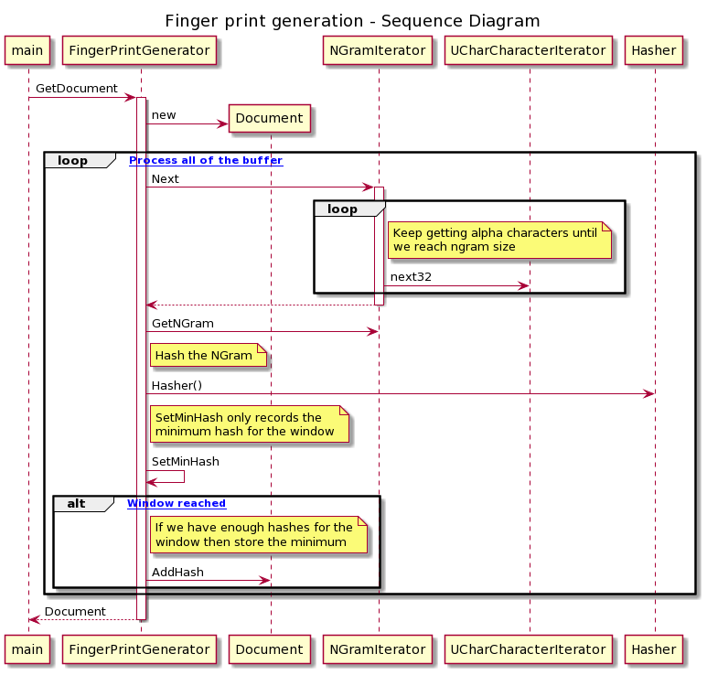

# Fingerprint-o-tron
Document fingerprinter<br>
Winnowing document fingerprinting<br>
A C++ implementation of this algorithm:

http://igm.univ-mlv.fr/~mac/ENS/DOC/sigmod03-1.pdf

# Building
To build it requires CMake and GNU C++ (min version 4.8) and ICU (for Debian apt-get install libicu-dev for Centos or Red Hat yum install libicu-devel). The build steps are simply:<br>
cmake .<br>
make<br>
make test<br>
<br>
Once built it produces a library and a utility "compare". 
# Running
Run "compare" passing the files (UTF-8 text) to compare against each other. The utility can take either directories or individual files, it will work out what to do. It will then fingerprint each document and compare the results with every other document. As each document is compared it outputs the percentage of fingerprints that are common to both documents. Finally it lists all the documents that are similar to each other (as in have a > 20% fingerprint match).
<br>
Example output (running against directory called "examples" containing 4 text files):<br>
<br>
```
./compare examples

Comparing documents with the following parameters:
NGramSize = 10
WinnowSize = 9
Threshold = 20

Processing files:
examples/random.txt
examples/test1.txt
examples/test1_same.txt
examples/test2.txt

examples/random.txt - examples/test1.txt %2
examples/random.txt - examples/test1_same.txt %2
examples/random.txt - examples/test2.txt %2
examples/test1.txt - examples/test1_same.txt %100
examples/test1.txt - examples/test2.txt %65
examples/test1_same.txt - examples/test2.txt %65

Similar documents:
examples/test1.txt examples/test1_same.txt examples/test2.txt
```
so test1.txt has 65% of its fingerprints in common with test2.txt. rand.txt only has 2% in common with test1.txt.<br>
<br>
test1.txt / test1_same.txt and test2.txt all have common fingerprints.<br>
<br>
# Using the library
To use the library from within your own code the unit test "test_system.cpp" is a good starting point, then take a look at main.cpp.<br>
main.cpp loads the text files for comparision, generates the fingerprints and then performs analysis to find all documents deemed similar.
# Fingerprint generation

